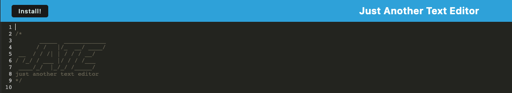

# Progressive-Web-Applications-Text-Editor

## Description

This project is a progressive web application, meaning that it can be accessed without internet access. Once the app is opened, the user can download a text editor or type directly into the text editor. Even without internet, a user's input can be accessed and saved. The application accomplishes offline saving by using local storage and a cache. 

Live Link: https://guarded-gorge-10756.herokuapp.com/

## Installation

In order to run this application, run <npm i> in the terminal to install express.js, Webpack, the webpack-dev-server, the Webpack Manifest, Babel, CSS-Loader, and the IndexedDB. If you would rather install manually, run the following commands in the integrated terminal.

1) npm install express

2) npm install --save-dev webpack 

3) npm install webpack-dev-server --save-dev

4) npm install --save-dev webpack-pwa-manifest

5) npm install babel

6) npm install --save-dev css-loader

## Usage
)

Live Link: https://guarded-gorge-10756.herokuapp.com/

## Credits
This challenge was made while in attendance of the University of Texas's Full Stack Coding Bootcamp in conjunction with Trilogy Education.

## License
MIT License

Copyright (c) 2022 Paris Bland

Permission is hereby granted, free of charge, to any person obtaining a copy
of this software and associated documentation files (the "Software"), to deal
in the Software without restriction, including without limitation the rights
to use, copy, modify, merge, publish, distribute, sublicense, and/or sell
copies of the Software, and to permit persons to whom the Software is
furnished to do so, subject to the following conditions:

The above copyright notice and this permission notice shall be included in all
copies or substantial portions of the Software.

THE SOFTWARE IS PROVIDED "AS IS", WITHOUT WARRANTY OF ANY KIND, EXPRESS OR
IMPLIED, INCLUDING BUT NOT LIMITED TO THE WARRANTIES OF MERCHANTABILITY,
FITNESS FOR A PARTICULAR PURPOSE AND NONINFRINGEMENT. IN NO EVENT SHALL THE
AUTHORS OR COPYRIGHT HOLDERS BE LIABLE FOR ANY CLAIM, DAMAGES OR OTHER
LIABILITY, WHETHER IN AN ACTION OF CONTRACT, TORT OR OTHERWISE, ARISING FROM,
OUT OF OR IN CONNECTION WITH THE SOFTWARE OR THE USE OR OTHER DEALINGS IN THE
SOFTWARE.